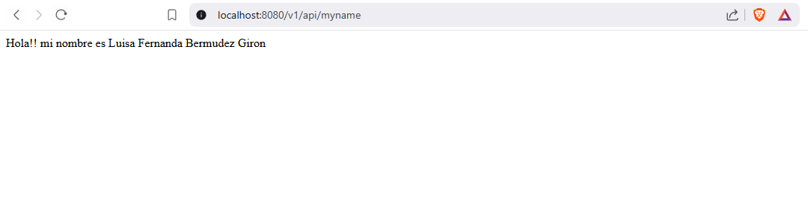
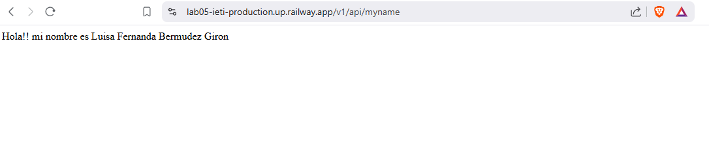

# Despliegue App Spring Boot con Github y Raylway.app

Se implementa un microservicio REST con Spring Boot que envia como respuesta un nombre y se despliega con Raylway.

### Ejecución

*1. Local*

Para acceder de manera local utilice la siguiente url:

http://localhost:8080/v1/api/myname

*2. Despliegue*

Para el despliegue utilice la siguiente url:

https://lab05-ieti-production.up.railway.app/v1/api/myname

## Autor

* **[Luisa Fernanda Bermudez Giron](https://www.linkedin.com/in/luisa-fernanda-berm%C3%BAdez-gir%C3%B3n-b84001262/)** - [LuisaGiron](https://github.com/LuisaGiron)

## Licencia
*©* Luisa Fernanda Bermudez Giron. Estudiante de Ingeniería de Sistemas de la Escuela Colombiana de Ingeniería Julio Garavito